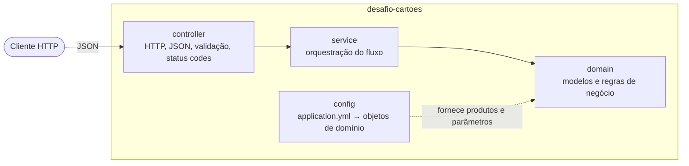
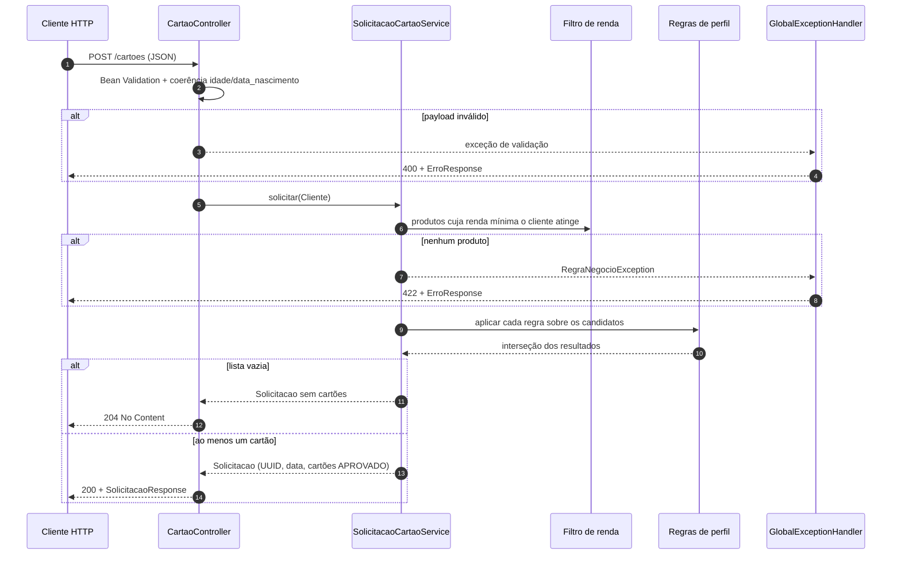
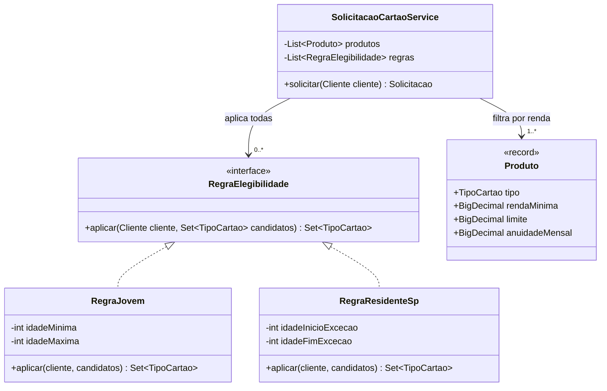

# SDD - API de Cartões de Crédito

Documento de design do projeto `desafio-cartoes`. Registra a arquitetura, as regras de negócio
adotadas e as decisões tomadas, com o motivo de cada uma. O contrato da API está em
`src/main/resources/openapi.yaml` e as considerações de evolução em `CONSIDERACOES.md`.

## 1. Objetivo

Expor um endpoint `POST /cartoes` que recebe os dados de um cliente e devolve os produtos de
cartão de crédito elegíveis ao seu perfil, conforme regras de renda, idade e UF.

## 2. Escopo

Endpoint único, validação de entrada, regras de elegibilidade, tratamento de erros
padronizado, configuração externalizada, logs, healthcheck, documentação da API, container.

## 3. Stack

| Item | Escolha | Motivo |
|---|---|---|
| Linguagem | Java 21 | LTS consolidada no mercado corporativo; nenhum recurso do projeto exige versão superior |
| Framework | Spring Boot 4.1.1 (Web, Validation, Actuator) | Suporte nativo ao que o desafio pede |
| Build | Maven | Padrão de mercado, wrapper incluído |
| Documentação | OpenAPI 3.0 + springdoc (Swagger UI) | Padrão da indústria; contrato escrito antes do código |
| Persistência | Nenhuma | Opcional no enunciado; a API é stateless |
| Lombok | Não | `record` cobre imutabilidade, construtor e acessores |

## 4. Arquitetura

### 4.1 Camadas

Três camadas com dependência em um único sentido, mais um pacote de configuração.
O `domain` não importa nenhum outro pacote.



| Camada | Responsabilidade | Muda quando |
|---|---|---|
| `controller` | Receber e responder HTTP, DTOs em snake_case, validação de formato, conversão de exceções em payload de erro | O contrato muda |
| `service` | Sequenciar o fluxo: filtro de renda, regras de perfil, montagem da solicitação. Nenhuma decisão de negócio | O fluxo muda (ex.: passar a persistir) |
| `domain` | Modelos (`Cliente`, `Produto`, `TipoCartao`) e regras de elegibilidade. Java sem infraestrutura; apenas `@Component` para auto-descoberta | O negócio muda |
| `config` | Ler `application.yml` e converter em `List<Produto>` e parâmetros do domínio | A origem dos valores muda |

### 4.2 Estrutura de pacotes

```
br.com.desafio.cartoes
├── controller
│   ├── CartaoController
│   ├── dto        (SolicitacaoRequest, ClienteDto, SolicitacaoResponse, CartaoOfertadoDto, ErroResponse)
│   ├── mapper     (SolicitacaoMapper)
│   └── handler    (GlobalExceptionHandler)
├── service
│   └── SolicitacaoCartaoService
├── domain
│   ├── model      (Cliente, Produto, TipoCartao, StatusCartao, CartaoOfertado, Solicitacao)
│   ├── regra      (RegraElegibilidade, RegraJovem, RegraResidenteSp)
│   └── exception  (RegraNegocioException)
└── config
    ├── CartoesProperties
    ├── CartoesConfig
    └── OpenApiController
```

Organização por camada, adequada a um único contexto de negócio. Se surgir um segundo
contexto, a evolução é agrupar por funcionalidade (`cartoes/`, `emprestimos/`, `shared/`),
uma mudança mecânica que as camadas já permitem.

### 4.3 Fluxo de uma requisição



## 5. Regras de negócio

### 5.1 Produtos

| Produto | Renda mínima | Limite | Anuidade mensal |
|---|---|---|---|
| CARTAO_SEM_ANUIDADE | 3.500,00 | 1.000,00 | 0,00 |
| CARTAO_DE_PARCEIROS | 5.500,00 | 3.000,00 | 10,00 |
| CARTAO_COM_CASHBACK | 7.500,00 | 5.000,00 | 20,00 |

Todos os valores vêm do `application.yml` (seção 7).

### 5.2 Fluxo de decisão

1. **Filtro de renda:** candidatos = produtos cuja renda mínima o cliente atinge.
   Vazio → `422`.
2. **Regras de perfil:** cada regra recebe os candidatos e devolve um subconjunto.
   Regras só removem, nunca adicionam. O resultado é a interseção de todas, portanto a ordem
   de execução é irrelevante. Vazio → `204`.
3. **Montagem:** UUID, data/hora e cartões com status `APROVADO`, limite e anuidade.

### 5.3 Regras de perfil

| Regra | Condição | Efeito |
|---|---|---|
| `RegraJovem` | idade entre 18 e 24 | mantém apenas CARTAO_SEM_ANUIDADE |
| `RegraResidenteSp` | UF = SP e idade fora de 25 a 29 | mantém apenas CARTAO_SEM_ANUIDADE e CARTAO_COM_CASHBACK |
| `RegraResidenteSp` | UF = SP e idade entre 25 e 29 | não restringe (exceção prevista no enunciado) |

Resultado por faixa, sempre limitado pela renda:

| Idade | Fora de SP | Em SP |
|---|---|---|
| 18 a 24 | só sem anuidade | só sem anuidade |
| 25 a 29 | conforme renda | todos, conforme renda |
| 30 ou mais | conforme renda | cashback e sem anuidade, conforme renda |

A idade usada nas regras é calculada a partir de `data_nascimento`.

### 5.4 Diagrama de classes das regras



O service depende apenas da interface. O Spring injeta todas as implementações anotadas com
`@Component`, então **adicionar uma regra é criar uma classe**; nenhum código existente é
alterado.

## 6. Contrato e tratamento de erros

Endpoint, campos e payloads seguem exatamente o enunciado (snake_case). Detalhes em
`openapi.yaml`.

| Status | Quando | `tipo_erro` |
|---|---|---|
| 200 | Ao menos um cartão aprovado | — |
| 204 | Renda atendida, mas regras de perfil zeraram a lista | — |
| 400 | JSON malformado, campo obrigatório ausente, renda negativa, menor de 18, `idade` incoerente com `data_nascimento` | `ERRO_VALIDACAO` |
| 415 | Content-Type diferente de `application/json` | `FORMATO_NAO_SUPORTADO` |
| 422 | Renda abaixo da renda mínima de todos os produtos | `RENDA_INSUFICIENTE` |
| 500 | Erro não previsto; sem stack trace ou detalhe interno na resposta | `ERRO_INTERNO` |

Toda exceção passa por um único `GlobalExceptionHandler`, que produz o payload
`{codigo, mensagem, detalhe_erro}`.

### 6.1 Logs

Só existe log de erro — nenhum INFO, de propósito: logar cada requisição
bem-sucedida é redundante (o próprio `200`/`204` já é a confirmação) e só
dificulta achar o que importa em meio ao volume. `WARN` para 4xx (erro do
cliente, sem stack trace — não ajuda a depurar payload mal formado ou renda
negativa); `ERROR` para 5xx, com a exceção completa, já que é a única resposta
não prevista.

Toda linha de erro é estruturada em `campo=valor`: `evento` (categoria da
ocorrência), `excecao` (nome da classe lançada), `metodo` e `caminho` da
requisição, `status` HTTP e `tipo_erro`. Classe de origem e momento não entram
na mensagem — já vêm de graça em cada linha via `%logger`/`%d` do Logback,
duplicar seria redundante.

Nunca entram no log, nem no de 500: CPF, e-mail, telefone, `data_nascimento` ou
o payload — mesma restrição da resposta HTTP, porque log também é dado saindo
do sistema. Isso vale porque toda mensagem de exceção no código é estática,
sem interpolar dado do cliente; exceção nova deve manter essa disciplina.

## 7. Configuração

Parâmetros de negócio ficam no `application.yml`, lidos por `CartoesProperties`
(`@ConfigurationProperties` + `@Validated`) e convertidos em objetos de domínio por
`CartoesConfig`:

```yaml
cartoes:
  idade-minima: 18
  faixa-jovem:
    inicio: 18
    fim: 24
  faixa-excecao-residente-sp:
    inicio: 25
    fim: 29
  produtos:
    - tipo: CARTAO_SEM_ANUIDADE
      renda-minima: 3500.00
      limite: 1000.00
      anuidade-mensal: 0.00
    - tipo: CARTAO_DE_PARCEIROS
      renda-minima: 5500.00
      limite: 3000.00
      anuidade-mensal: 10.00
    - tipo: CARTAO_COM_CASHBACK
      renda-minima: 7500.00
      limite: 5000.00
      anuidade-mensal: 20.00
```

Produtos são lista, não mapa: um mapa normalizaria a chave (o Spring costuma converter o
nome do enum para lowercase-hífen ao usá-lo como chave de propriedade) e não garante ordem
de leitura; a lista preserva ambos, e a ordem do yml passa a ser a ordem dos cartões na
resposta.

Regra do projeto: **nenhum valor de negócio aparece como literal no código**, inclusive em
mensagens de erro. Parâmetro é config; comportamento é código. Alterar um valor exige restart,
o que em produção é um rolling restart via deploy, com a mudança versionada e revisável.

## 8. Decisões

| # | Decisão | Motivo |
|---|---|---|
| 1 | Camadas simples em vez de hexagonal | Um único caso de uso; hexagonal seria estrutura sem uso |
| 2 | Regras em `domain`, não em `service` | Regra e fluxo mudam por motivos diferentes; evita service com `if` acumulados |
| 3 | `domain` sem infraestrutura, com `@Component` permitido | Testes com `new`; auto-descoberta de regras sem registro manual |
| 4 | Regras como filtros por interseção, sem `@Order` | Comutativo; regra nova nunca altera as existentes |
| 5 | Exceção 25–29/SP dentro de `RegraResidenteSp` | É uma exceção à regra de SP, não uma regra independente |
| 6 | 422 para renda insuficiente, 204 para lista vazia após perfil | Fronteira clara: crédito versus perfil; o enunciado usa renda como exemplo de 422 |
| 7 | `data_nascimento` como fonte da idade; `idade` divergente → 400 | O enunciado valida menor de idade pela data; dado inconsistente não entra na análise |
| 8 | Apenas cartões `APROVADO` na resposta | Sem cartão o cliente recebe 422 ou 204, não uma lista de reprovados |
| 9 | Payload de erro do enunciado, sem RFC 9457 | O payload era obrigatório; a RFC era recomendação. Conciliação registrada como evolução |
| 10 | Sem banco | Opcional; nada no fluxo exige estado |
| 11 | DTOs separados do domínio | Nomes exatos do contrato sem Jackson vazando para as regras |
| 12 | `BigDecimal` para valores monetários | Precisão e formato `0.00` exigido |
| 13 | Anuidade de CARTAO_DE_PARCEIROS = 10,00 | Enunciado não define; valor de estudo, parametrizado |
| 14 | Filtro de renda criado via `@Bean` e regras de perfil via `@Component` | O filtro é único e montado a partir do config; as regras são várias e descobertas automaticamente |
| 15 | `Clock` injetado para idade e data da solicitação | Testes determinísticos, sem dependência da data real |
| 16 | Só as validações exigidas pelo enunciado foram implementadas (campos obrigatórios, renda não negativa, idade mínima); sem validador ou anotação customizados | O enunciado dispensa validação de tipo/formato; anotações padrão do Bean Validation bastam |
| 17 | Idade mínima e coerência idade/`data_nascimento` verificadas em `SolicitacaoMapper.toCliente`, não em anotação | Idade mínima vem de `cartoes.idade-minima` (não é constante de compilação, `@Min` não aceita); coerência cruza dois campos do DTO |
| 18 | Log só de erro (`WARN`/`ERROR`), sem `INFO` | Logar toda requisição bem-sucedida é redundante e polui o log; ver seção 6.1 |
| 19 | Swagger UI aponta para o `openapi.yaml` estático (`springdoc.swagger-ui.url`), sem gerar o contrato via anotação | Evita duas fontes de verdade divergindo; o arquivo já é completo (exemplos, todos os status) e anotação em DTO/controller só duplicaria isso |
| 20 | `openapi.yaml` servido por `OpenApiController` (`@GetMapping` devolvendo `ClassPathResource`), não por `ResourceHandlerRegistry` | `ResourceHandlerRegistry` recusa location `classpath:/` (expõe o classpath inteiro); um endpoint dedicado a um único arquivo evita reabrir esse mapeamento genérico e dispensa reverter `spring.web.resources.add-mappings=false` |

## 9. Ambiguidades do enunciado e resolução

| Ambiguidade | Resolução |
|---|---|
| Exemplo de saída dá cashback a renda 4000, contra a tabela | Exemplo tratado como ilustração de formato |
| `CARTAO_COM_CASHBACH` no exemplo | Erro de digitação; vale o domínio oficial `CARTAO_COM_CASHBACK` |
| Idades 18, 25 e 30 sem regra explícita | 18 entra na faixa jovem; 25 entra na faixa 25–29; 30 cai na regra geral |
| `idade` e `data_nascimento` podem divergir | Data é a verdade; divergência é 400 |
| 204 e 422 se sobrepõem para renda insuficiente | Renda → 422; lista vazia após perfil → 204 |
| Regras adicionais ignoram ou restringem a renda? | Restringem. Ex.: 32 anos, SP, renda 8000 não recebe parceiros |
| Anuidade de parceiros ausente | Definida em 10,00 |
| Com as regras atuais o 204 é inalcançável | O sem anuidade sobrevive a todas as regras. Caminho mantido por contrato e coberto por teste com regra fictícia |

## 10. Padrões utilizados

| Padrão | Onde | Motivo |
|---|---|---|
| Strategy | `RegraElegibilidade` e implementações | Regras intercambiáveis, aplicadas em pipeline por interseção |
| DTO | `controller.dto` | Isola o contrato externo do domínio |
| Mapper | `SolicitacaoMapper` | Conversão explícita DTO ↔ domínio |
| Tratamento centralizado de erros | `GlobalExceptionHandler` | Um único ponto de conversão exceção → payload |
| Injeção de dependência | Todo o projeto | Dependências explícitas por construtor; testes sem Spring |
| Configuração externalizada | `CartoesProperties` | Parâmetros fora do código |

## 11. Testes

| Nível | O que cobre | Como |
|---|---|---|
| Unitário (domínio) | Cada regra isolada, bordas 3499.99/3500, 17/18, 24/25, 29/30, SP/não SP | `new Regra(...)`, valores pelo construtor, sem Spring |
| Unitário (service) | Fluxo 422/204/200, inclusive 204 com regra fictícia que zera a lista | Mockito |
| Integração | `POST /cartoes` ponta a ponta, todos os status codes, formato dos campos | `@SpringBootTest` + MockMvc, `application.yml` próprio em `src/test/resources` |

Testes ficam no mesmo commit da funcionalidade que cobrem.

## 12. Evolução

Ver `CONSIDERACOES.md`.